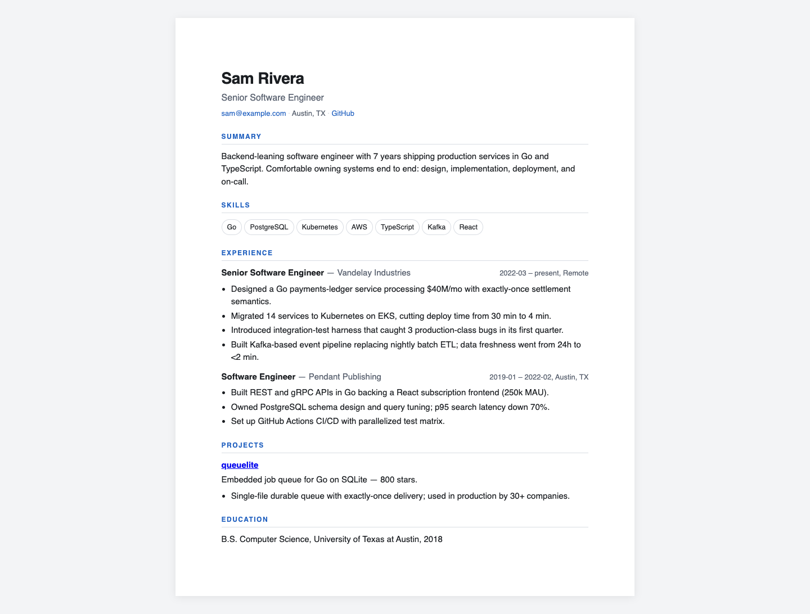

# jobkit

A multi-purpose job application & resume toolkit — one Go binary, offline-first,
agent-friendly. Built for software-engineering job hunts but profile/lexicon
driven, so it works for any field you can describe in skills and bullets.

## Showcase




This is real HTML output generated from the repository's fictional example
profile and job description, with no personal data. It is the reviewed evidence
declared in `portfolio/manifest.yaml`.

## What it does

| Surface | Verb | What you get |
|---|---|---|
| Master profile | `jobkit init`, `jobkit profile show\|validate\|path`, `jobkit profile bootstrap --source resume.pdf` | One YAML source of truth (`~/.jobkit/profile.yaml`) every other command reads; bootstrap can draft it from trusted local resume text/PDF |
| Saved searches | `jobkit search init\|list\|show\|run\|digest`, `jobkit find ... --save NAME` | Editable `~/.jobkit/searches.yaml` with board groups, curated `#target` packs, repeatable search profiles, and digest runs |
| Hidden market | `jobkit company add\|signal\|list\|show`, `jobkit contact add\|touch\|referral\|import` | Target-company intelligence, fresh hiring signals, recruiter/contact CRM, referral state, and LinkedIn connections-export bulk import with target-company overlap detection |
| JD intelligence | `jobkit jd parse <jd>`, `jobkit jd fetch <url>` | Skills detected against a 150-entry tech lexicon (longest-match, no double counting), weighted by section (requirements 2×, nice-to-have 0.75×, per-skill cap), seniority estimate. Every `<jd>` argument accepts a file, a live posting URL, or `-` for stdin |
| Eligibility gate | `jobkit eligibility init\|check\|show\|path` | Keeps hard constraints (geography, language, years, role family, work mode, travel, management/sales) separate from skill fit and opportunity; classifies each role `eligible`, `review`, or `ineligible` with reasons |
| Job search | `jobkit find <query> --targets ai-infra [--eligibility actionable] [--inbox]` | Queries public Greenhouse/Lever/Ashby boards, normalizes postings, applies the eligibility policy before ranking, scores compensation/freshness/saturation/persona fit, warns on skipped boards by default, and can queue deduped results |
| Ranking calibration | `jobkit calibrate report\|apply [--persona NAME]` | Learns opportunity-score weights from inbox/tracker outcomes, writes `~/.jobkit/calibration.yaml`, and automatically feeds calibrated weights back into `find`, `search run`, and `search digest` |
| Inbox queue | `jobkit inbox add\|recheck\|slate\|list\|show\|stale\|set\|note\|outreach\|form` | Append-only pre-application queue with dedupe IDs, eligibility, fit, source/last-seen provenance, outreach drafts, and form-fill packets; `slate` enforces a deterministic weekly lane mix and employer cap |
| Claims gate | `jobkit claims init\|check\|show\|path` | Fact lock for generated material: an allowlist of verified quantified claims (`~/.jobkit/claims.yaml`); when present, resume/letter/apply generation fails closed on any number it can't trace to a verified claim |
| Gap scoring | `jobkit match <jd>` | 0–100 weighted coverage score, matched skills with evidence class (declared/tagged/text), missing skills, tailoring advice |
| Human-in-loop plan | `jobkit apply-plan <jd\|url\|inbox-id>` | Reviewable package with resume, letter, prep, match and eligibility receipts, raw JD, and checklist; ineligible roles fail closed unless a human records an explicit override; no submit |
| Golden path | `jobkit apply <jd>` | One shot: tailored resume + letter + prep + match/eligibility receipts + raw JD into `~/.jobkit/out/<id>/`, tracked with fit and eligibility provenance |
| Tailored resumes | `jobkit resume build <jd> [--format md\|txt\|html\|pdf]` | Skills reordered and bullets ranked by JD relevance (capped at 4/role); renders Markdown, ATS-safe plain text, print-ready single-file HTML, or PDF via headless Chrome |
| Cover letters | `jobkit letter build <jd> [--tone professional\|warm\|direct]` | Deterministic draft that weaves your top matched skills with their best supporting bullet — honest about the top required gap |
| Interview prep | `jobkit prep <jd>` | Per-skill deep-dive questions anchored to your own stories, gap-defense bridges, a STAR story bank, questions to ask them |
| Interview coach | `jobkit coach source\|deck\|run\|stats\|serve` | Evidence-linked project drills, deterministic claim-safe scoring, spaced reviews, optional advisory AI feedback, and a localhost practice UI |
| Application tracker | `jobkit track add\|list\|show\|set\|note\|board\|stats\|followups\|remind` | Append-only JSONL event ledger; funnel board, response-rate stats, verified nicos-resume manifest import, artifact/claim provenance, follow-up nudges, and text/ICS reminder export |

## Quick start

```sh
make install            # builds and copies to ~/.local/bin/jobkit
jobkit profile bootstrap --source ~/Downloads/resume.pdf --out auto
# or: jobkit init     # create ~/.jobkit/profile.yaml, then edit it
jobkit profile validate

# Hard constraints stay separate from fit/opportunity ranking:
jobkit eligibility init --home "St. Louis, MO" --countries "United States,USA,US" --languages English --years 7 --relocation-open
jobkit eligibility check posting.txt --location "Remote - US" --remote

# Saved searches + inbox:
jobkit search init
jobkit find backend go --targets ai-infra --remote --sort opportunity --persona agent-infra --min-comp 250000 --eligibility actionable --save backend-go --inbox
jobkit search run backend-go --inbox
jobkit search digest --inbox --out auto
jobkit inbox recheck
jobkit inbox list
jobkit inbox slate --out auto  # 5 platform, 3 full-stack, 1 adoption/FDE, 1 stretch; max 2/company
jobkit inbox stale --days 14
jobkit calibrate report --persona agent-infra
jobkit calibrate apply --persona agent-infra --min-samples 8
jobkit company add "Modal" --domain modal.com --tags ai,infra --boards ashby:Modal --target-comp 400000
jobkit company signal "Modal" --type team-growth --source linkedin --note "infra hiring push"
jobkit contact add "Jane Recruiter" --company Modal --channel linkedin --source search --inbox-id <inbox-id>
jobkit contact referral modal --status referral-requested --note "asked for routing advice" --track-id <track-id>

# Point any JD command at a posting URL, a saved file, an inbox id, or stdin:
jobkit match https://job-boards.greenhouse.io/acme/jobs/123
jobkit apply-plan <inbox-id> --tone warm
jobkit inbox outreach <inbox-id> --channel linkedin --out auto
jobkit inbox form <inbox-id> --out auto
jobkit apply https://job-boards.greenhouse.io/acme/jobs/123 --tone warm
#   → ~/.jobkit/out/acme--role/  (resume.html, letter.txt, prep.md, jd.txt, match.json)
#   → tracked with its match score

jobkit prep posting.txt                 # interview-prep sheet
# Import a reviewed standalone source bundle:
jobkit coach source import examples/coach-source.json
jobkit coach deck --job posting.txt --mode mixed --minutes 20
jobkit coach run latest --answers examples/coach-answers.json
jobkit coach stats
jobkit coach serve                      # http://127.0.0.1:7331 only
jobkit track set acme --status applied \
  --resume-manifest path/to/resume-manifest.json \
  --resume-artifact pdf \
  --resume-artifact-file path/to/resume.pdf \
  --lane platform --source cold
jobkit track followups --days 7
jobkit track remind --format ics --out auto
```

`make demo` runs the full walkthrough against `examples/` in an isolated
temp state dir.

Coach source bundles use the public `jobkit.coach.source.v1` contract. The
import rejects local paths, private evidence markers, unknown claim links, and
non-public scope. A deck becomes invalid when its imported source changes.
Raw answers stay in `~/.jobkit/coach/sessions.jsonl`.

Deterministic scoring is authoritative. An unsupported quantified claim caps
the answer below 60 and schedules it for review in one day. Optional provider
commands receive JSON on standard input and return advisory JSON on standard
output. JobKit executes configured argument arrays directly, without a shell.
Provider argument count, argument size, runtime, and output are bounded. Stored
provider failures contain an exit code, not raw provider error text. The ndev bridge creates a local Ollama adapter and clearly named hosted Gemini
and OpenAI adapters. Selecting a hosted adapter is an explicit data boundary:
it sends the practice request and answer text to that provider.

`jobkit coach serve` accepts loopback addresses only. It prints a URL with an
ephemeral access token, exchanges that token for a protected local cookie, and
enforces host, origin, and content-security checks. The web UI uses the same
deck, versioned rubric, scoring, session, feedback, and statistics contracts as
the CLI. A configured local transcriber adds microphone answers without
sending audio through JobKit.

`track add` and `track set` accept a nicos-resume package receipt through
`--resume-manifest`. JobKit rejects candidate/history manifests, incomplete or
failed verification gate sets, malformed SHA-256 digests, and an upload file
whose digest differs from the selected manifest artifact. It records source,
claim-set, and selected-artifact digests plus version, variant, and artifact
kind without copying the resume itself into the ledger. JobKit-generated
`apply`/`apply-plan` artifacts receive the same digest and tailoring-receipt
tags automatically; eligibility overrides are structured tags rather than
notes alone. A repeated `apply-plan` for the same active inbox item reuses its
tracker record and private output directory. It does not move an applied,
skipped, or archived inbox item back to `planned`.

## Publication checks

Local publication gate (no remote push):

```sh
make publish-ready   # race + publication + optional verified-claims bridge
make demo            # isolated JOBKIT_HOME; uses examples/ only
```

`make verify` runs gofmt, the test suite, `go vet`, and the deterministic
dependency license audit. `make publish-ready` additionally runs the race
suite, a reachable-code vulnerability scan, history/tree secret scans, and the
optional verified-claims bridge. The bridge prefers the maintained
`agent-ops claims check` surface and uses the deprecated standalone
`claimguard` binary only as a compatibility fallback. The
license audit fails closed if a compiled non-standard dependency is not
allowlisted or if its upstream license text changes.
`LICENSE` covers Nico-authored JobKit code; `THIRD_PARTY_NOTICES.md` records
dependency rights. Personal JobKit state under `~/.jobkit` is never part of a
source publication — only synthetic `examples/` fixtures ship.

## Agent contract

Every verb takes `--json` and emits `{ok, data}` or
`{ok:false, error:{code, message, hint}}`. Exit codes: `0` ok, `1` error,
`2` `INVALID_ARGS`, `3` `NOT_FOUND`. Flags may appear anywhere
(`--k v` or `--k=v`). `-` reads the JD from stdin.

For agent context windows prefer **`jobkit help --compact`** (or
`jobkit help --json --compact`) instead of the full human usage dump.

Job search is partial-result tolerant by default: if one board in a group is
stale or unavailable, text mode prints a warning to stderr and JSON mode
includes `warnings` while returning successful-board results. Pass `--strict`
to fail the whole search on the first board error.

Search can be ranked by opportunity signals: `--sort opportunity|comp|freshness`
and `--min-comp N` use extracted salary ranges when postings include them;
`--persona NAME` biases the opportunity score toward a search persona such as
`agent-infra`, `ai-product`, `devtools`, or `backend-platform`. Once
`jobkit calibrate apply` writes `~/.jobkit/calibration.yaml`, all public-board
search ranking uses those active weights automatically.

When `~/.jobkit/eligibility.yaml` exists, `find` and saved searches assess hard
constraints before opportunity sorting and default to the `actionable` set
(`eligible` + `review`). `ineligible` roles are excluded by default. `apply`
and `apply-plan` fail closed for an ineligible role; `--override-eligibility`
is an explicit human escape hatch and the override is recorded in the tracker
and package receipt. JobKit never submits an application or sends outreach.

Environment:

- `JOBKIT_HOME` — state dir (default `~/.jobkit`): profile, eligibility,
  searches, companies, calibration, ledgers, telemetry, out/
- `JOBKIT_PROFILE` — profile path override (useful for multiple personas)
- `JOBKIT_TELEMETRY=off` — disable per-run telemetry (`telemetry.jsonl`)
- `JOBKIT_CHROME_BIN` — explicit Chrome/Chromium binary for PDF export
- `JOBKIT_GREENHOUSE_BASE`, `JOBKIT_LEVER_BASE`, `JOBKIT_ASHBY_BASE` — test/dev
  overrides for public board API base URLs

## Design notes

The complete stack rationale and revisit triggers are in
[`docs/architecture.md`](docs/architecture.md).

- **The profile is the database.** Skills carry levels/years/aliases; bullets
  carry tags. Match evidence is three-tiered: declared skill > bullet tag >
  free-text mention — and the gap report tells you when to promote one. The
  one-way, SemVer'd consumer boundary is documented in
  [`contracts/profile/`](contracts/profile/); consumers validate the synthetic
  fixture instead of importing JobKit's internal Go package.
- **The ledger is history.** `applications.jsonl` and `contacts.jsonl` are
  append-only; state is a replay. Cross-process file locks keep each appended
  event intact, so the funnel, follow-up, and referral trails are auditable.
- **Telemetry is bounded.** Schema v2 stores an allowlisted command identity,
  outcome, duration, and typed error only. Run `jobkit doctor telemetry` to
  count current, legacy, and invalid rows. Run it again with `--migrate` only
  after reviewing the count; migration removes legacy arguments and raw errors.
- **Hidden market means dated signals.** `companies.yaml` is intentionally
  human-editable: public ATS boards, target compensation, tags, and hiring
  signals combine into a next-action score so outreach can happen before a
  posting is everywhere.
- **Opportunity beats raw keyword match.** Public board results carry
  compensation, freshness, saturation, and persona scores. The default weights
  are useful immediately; `jobkit calibrate apply` tunes them against observed
  inbox/tracker outcomes as the hunt produces signal.
- **Eligibility is not fit.** Country/language/work-mode and role-family hard
  stops are evaluated independently. Unknown constraints become `review`, not
  a silent rejection; an excellent keyword score cannot promote an ineligible
  role into an application package.
- **A weekly slate is a policy, not a vibes list.** The default mix is five
  platform/DevEx/AI-infrastructure roles, three full-stack product roles, one
  technical-adoption/FDE role, and one stretch role, with at most two from one
  employer. Missing lanes remain visible as gaps rather than being backfilled
  with the wrong work.
- **Deterministic over generative.** Resume tailoring and letters are pure
  functions of profile + JD — no API keys, no hallucinated experience. An
  optional LLM polish pass is a planned add-on, not a dependency.
- **Multi-purpose by data.** The lexicon (`internal/jd/lexicon.txt`) is plain
  text (`canonical|aliases|category`); swap or extend it for non-SWE domains.

## Layout

```
cmd/jobkit/          CLI dispatch + usage (incl. the apply golden path)
internal/profile/    master profile schema + starter template
internal/jd/         JD parser + embedded skills lexicon + URL fetch/HTML→text
internal/jobsearch/  Greenhouse/Lever/Ashby search + opportunity ranking
internal/eligibility/ hard-constraint policy + explainable assessment
internal/calibration/ outcome-based opportunity weight calibration
internal/searches/   saved board groups + search profiles
internal/company/    hidden-market target-company intelligence
internal/contacts/   relationship/referral append-only ledger
internal/inbox/      pre-application saved-job queue
internal/match/      gap scoring + advice
internal/resume/     tailoring + md/txt/html renderers
internal/letter/     deterministic cover-letter drafts
internal/prep/       interview-prep sheet generator
internal/coach/      evidence source, rubric scoring, providers, and localhost UI
internal/track/      append-only application ledger + stats
internal/telemetry/  per-run JSONL telemetry (best-effort)
internal/strictyaml/ strict single-document YAML decoder
internal/privatefs/ private atomic writes and cross-process append locks
internal/envelope/   {ok, data|error} JSON contract
internal/home/       ~/.jobkit state-dir resolution
```

## Roadmap

- LLM polish pass for letters/summaries (opt-in, keychain-backed key)
- Native reminder delivery to macOS Reminders/Calendar (current `track remind`
  exports text or `.ics`)
- Browser-assisted form fill with explicit human approval at each page boundary
- Scheduled digest/target-company refresh automation
- Multi-profile personas (`JOBKIT_PROFILE` already supports the mechanics)
